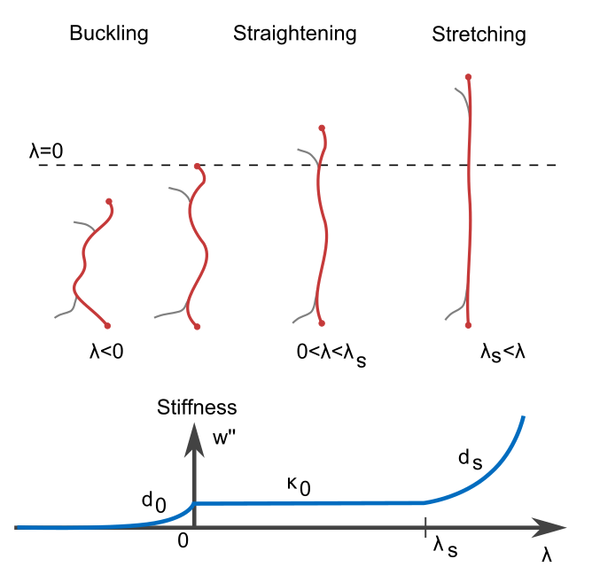

.. _SectionMaterial:

Material
========

Semi-Affine Fibers
------------------

    The stiffness :math:`\omega''(\lambda)` as a function of the stretching. It is the second derivative of the energy function
    :math:`\omega(\lambda)` of the material.

The default material model is a semi-affine fiber material which is approximated by a mean field description. The fibers
are modeled that they buckle under compression, showing an exponential decay of the stiffness (:math:`\lambda < 0`), have
a linear stiffnes regime during straightening (:math:`0<\lambda<\lambda_s`) and for larger streches shows an exponential
stiffening (:math:`\lambda_s<\lambda`).

Under the assumption that the material is isotrop, the action of the deformation on the material is average over all
spatial directions.

.. math::
    W = \langle\omega(|\mathbf{F} \cdot \vec{e_r}(\Omega)|-1)\rangle_\Omega

With :math:`\mathrm{F}` being the deformation gradient, :math:`\vec{e_r}` a unit vector in the direction :math:`\Omega`,
:math:`\omega(\lambda)` the material energy function, :math:`W` the energy density and
:math:`\langle \cdot \rangle_\Omega` denotes an average over the full body angle.

Materials
---------

.. currentmodule:: saenopy.materials

.. autoclass:: Material
   :members:

.. autoclass:: SemiAffineFiberMaterial
   :members:

.. autoclass:: LinearMaterial
   :members:

Defining custom materials
-------------------------

To define a custom material, simply subclass the base class `:py:class:saenopy.materials.Material` and define a stiffness
function as a method. For the use in the relaxation and regularization mode, this function is automatically evaluated to
create a look up table and integrated two times numerically to get the energy function.

.. code-block:: python
    :linenos:

    from saenopy.materials import Material

    class QuadracticMaterial(Material):
        """
        A custom material that has a quadratic stiffness.

        Parameters
        ----------
        k1 : float
            The stiffness of the material.
        """
        def __init__(self, k1):
            # parameters
            self.k1 = k1
            self.parameters = dict(k1=k1)

        def stiffness(self, s):
            # the stiffness increases linearly, resulting in a quadratic force
            stiff = np.ones_like(s) * self.k1 * s

            return stiff