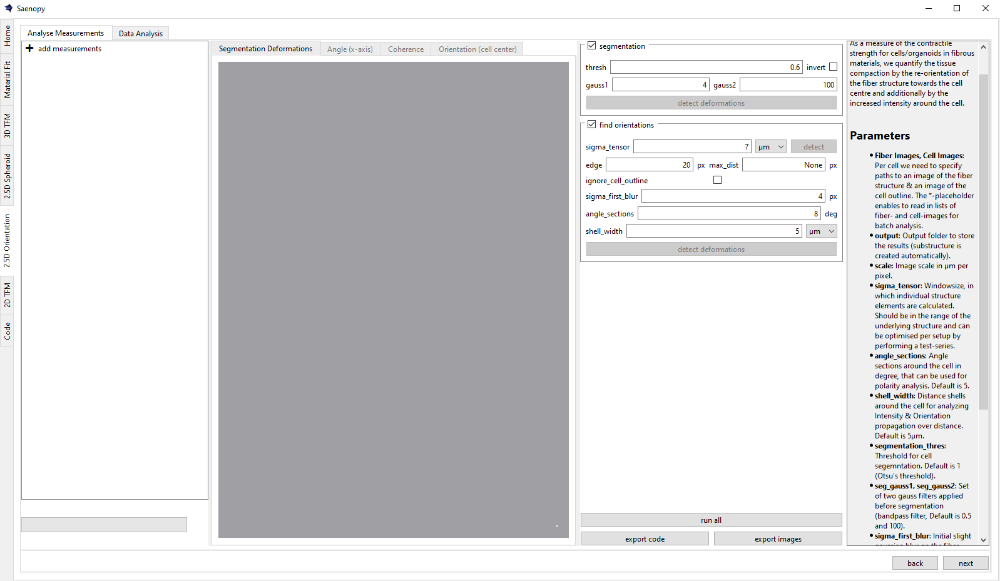
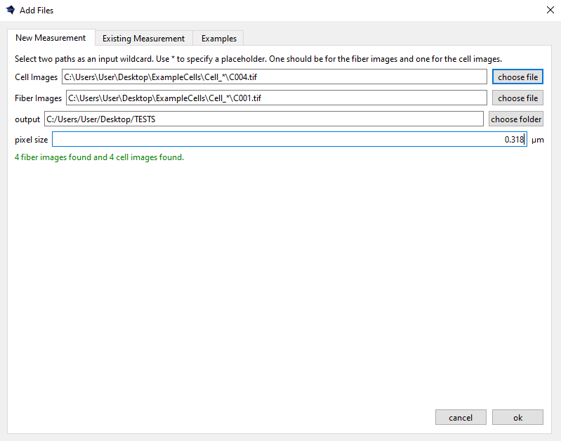

Interface
=========

Calculate the alignment and intensity of matrix fibers directed toward a cell embedded in a 3D biopolymer, based on 2D images. This measurement serves as an indirect proxy for cell contractility.

Alternatively, the tool can be used to simply quantify the alignment of cells or other structures relative to the x- or y-axis, by ignoring the cell images (set them to None).

Adding Measurements
-------------------

Loading a New Measurement
~~~~~~~~~~~~~~~~~~~~~~~~~

Batch searches of image pairs of the matrix structure (fiber images) and the cell outline (cell images) can be performed using placeholder "*" 
to enable open searches across different folders, allowing them to be read in parallel.

Further, the pixelsize and an output directory for results plots and python data files needs to be defined here.

Loading an Existing Measurement
~~~~~~~~~~~~~~~~~~~~~~~~~~~~~~~
Here an existing saenopy file can be loaded.

Loading an Example Measurement
~~~~~~~~~~~~~~~~~~~~~~~~~~~~~~
This tab provided example files that can be downloaded to showcase and test various applications of saenopy. Files will
be downloaded to a user directory and directly opened in saenopy.
