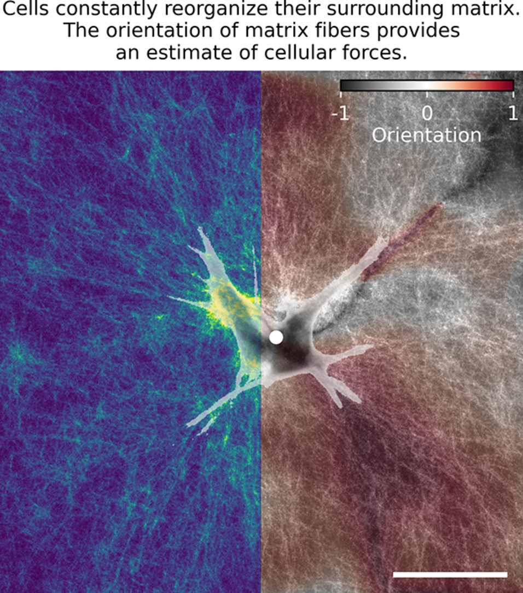

Theory
======

``CompactionAnalyzer`` is a Python package that quantifies the amount of **fiber alignment** and **fiber density** around contractile cells embedded in fibrous matrices.  
These features can serve as **proxy measures of contractile force**, or can also be used for other applications such as matrix remodeling assessment.

Unlike traditional traction force microscopy (TFM), this method does not rely on **rheological characterization of the matrix**.  
Instead, mechanical forces are inferred from the **geometry of gel deformation** and can be compared **relatively between conditions**, such as drug-treated versus control cells within the same matrix.

Key advantages include:

- **No material calibration**: The method quantifies normalized fiber alignment and density between cells.  
- **Broad applicability**: Compatible with a variety of biopolymer matrices such as collagen, or fibrin.  
- **Fast imaging & analysis workflow**: Typically uses 2D **maximum-intensity projections** around the cells in 3D gels (instead of full 3D image stacks).

How it works
------------

- Z-stacks of the fluorescently labeled cell and the surrounding fibrous matrix are acquired and maximum-intensity projections are generated around the cell surface
- The **cell area is segmented** from the projected cell image
- Local **fiber alignment** is computed using structure tensor analysis on the projected matrix image, and fiber orientations are transformed relative to the **radial direction from the cell center**.  
- **Fiber density** is calculated in concentric zones around the cell and normalized to background levels.  
- These normalized alignment and density values can be interpreted as **relative indicators of contractile force**, 
 under the assumption that increased alignment and densification correspond to stronger matrix compaction.

This approach enables **fast and calibration-free quantification** of cell-induced matrix remodeling and force output in 3D environments.

Further details are described in:

- **Publication**: Böhringer et al., *Fiber alignment in 3D collagen networks as a biophysical marker for cell contractility* (2023)  
  `DOI: https://doi.org/10.1016/j.matbio.2023.11.004 <https://www.sciencedirect.com/science/article/abs/pii/S0945053X23001166?via%3Dihub>`_

- **Github Repository**: `https://github.com/davidbhr/CompactionAnalyzer <https://github.com/davidbhr/CompactionAnalyzer>`_

