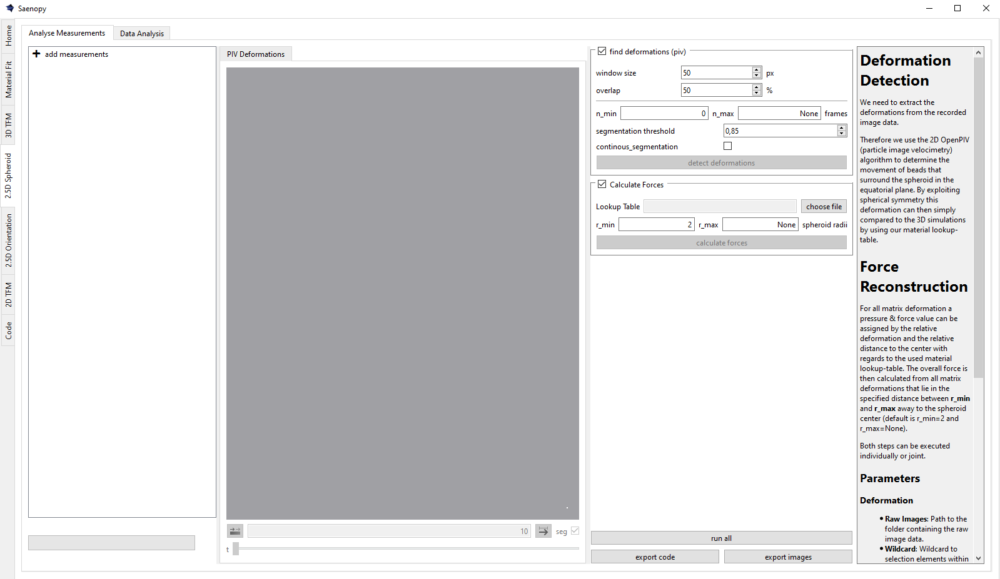
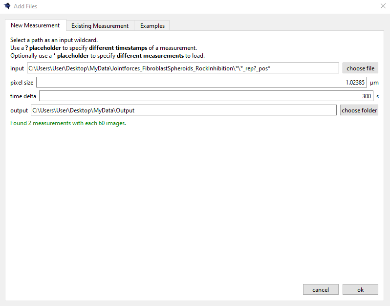

Interface
=========

Calculate 3D traction forces from 2D timelapse images at the equatorial plane of spheroids or organoids.

The left-hand panel allows you to load either new or existing measurements. 
A measurement typically consists of a timelapse image series of a spheroid or organoid.

Adding Measurements
-------------------

Loading a New Measurement
~~~~~~~~~~~~~~~~~~~~~~~~~

Batch searches of image series can be performed using placeholders: use "?" to represent varying timesteps, and optionally use "*" 
to enable open searches across different spheroid or organoid positions, allowing them to be read in parallel.

Loading an Existing Measurement
~~~~~~~~~~~~~~~~~~~~~~~~~~~~~~~
Here an existing saenopy file can be loaded.

Loading an Example Measurement
~~~~~~~~~~~~~~~~~~~~~~~~~~~~~~
This tab provided example files that can be downloaded to showcase and test various applications of saenopy. Files will
be downloaded to a user directory and directly opened in saenopy.
