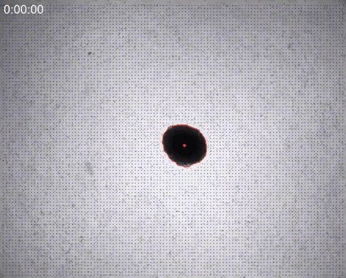

Theory
======

``jointforces`` is a Python package designed to quantify the contractile forces of multicellular spheroids or organoids embedded in 3D biopolymer gels such as collagen, fibrin, or Matrigel. The software combines **particle image velocimetry (PIV)** with **finite-element simulations** to reconstruct the mechanical forces generated by spheroids over time.

The key concept is the **assumption of spherical symmetry**, which greatly simplifies the complex inverse problem of traction force reconstruction. This allows for:

- **Robust force quantification** even in **optically dense 3D environments** where traditional traction force microscopy is challenging  
- **Significant speed-up** in computing traction forces by using simple brightfield imaging at the equatorial plane and pre-computed material-specific look-up tables  

How it works
------------

- ``jointforces`` analyzes time-lapse microscopy using `OpenPIV <https://github.com/OpenPIV/openpiv-python>`_ to compute local deformation fields in the gel.
- These measured fields are compared to a look-up table of **precomputed finite-element simulations**, which model how spherical contractile pressures deform the surrounding matrix.
- By identifying the best-matching simulation, the software estimates the **contractile pressure** and **total force** of the spheroid over time.

This method enables fast and scalable force estimation from brightfield or fluorescence microscopy, extending traction force analysis to multicellular systems that were previously inaccessible due to size-, time- or optical limitations.

For more details, see:

- **Publication**: `Mark et al., *eLife* (2020) <https://elifesciences.org/articles/51912>`_  
  *Collective forces of tumor spheroids in three-dimensional biopolymer networks*  
  (`PMC7192581 <https://www.ncbi.nlm.nih.gov/pmc/articles/PMC7192581/>`_)

- **Github Repository**: `https://github.com/christophmark/jointforces <https://github.com/christophmark/jointforces>`_
