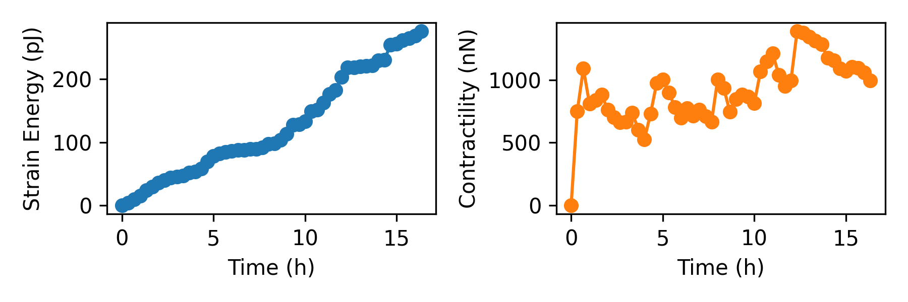

Read Files with Pyhton
=========

This is an example of how to read in and process Saenopy solver files using Python code. 

As an example, we read in a solver file containing a timelapse series of a contractile intestinal organoid embedded in collagen and imaged over several hours.

.. figure:: images/organoid_piv_timelapse.gif   
  :scale: 66%
  :align: center

In the Python interpreter, we first import Saenopy and other packages. Next, we load our result object, which contains a list of saenopy solvers. 
Here, each solver refers to a single timestep of the timelapse series (stack recorded every 20 minutes). 

.. code-block:: python

	import numpy as np
	import saenopy
	import matplotlib.pyplot as plt
	# paths to saenopy solver files
	path = r"myfolder//Pos007_S001_t{t}_z{z}_ch{c00}.saenopy"
	# load in result files with data, settings and parameters
	Result_file = saenopy.load(path)
	# get the solver objects containing the timelaps series with 3D matrices (nodes, forces,deformations, etc.) for each step 
	solvers = Result_file.solvers  

Next, we can read in the 3D arrays containing the coordinates, forces, and deformations either at a single time step (top; A) or all time steps at once (bottom; B).
Since we are only interested in the forces generated by the cells, we use a mask (regularisation_mask) to ignore the areas where the algorithm places the material balancing forces at the stack borders.

.. code-block:: python
	
	# A:  example of how to access the 3D arrays of the single (first) timestep t_idx 
	t_idx = 0
	mask_vaild = solvers[t_idx].mesh.regularisation_mask # ignore counterforces at the border 
	nodes_0 = solvers[t_idx].mesh.nodes[mask_vaild]
	displacemets_0 = solvers[t_idx].mesh.displacements[mask_vaild]
	forces_0 = solvers[t_idx].mesh.forces[mask_vaild] 
	
	#  B: Now Acces the complete time series
	#  Extract various parameters from these timelines (3D array for each timestep)
	nodes = [solvers[i].mesh.nodes[solvers[i].mesh.regularisation_mask] for i in range(len(solvers))]
	forces = [solvers[i].mesh.forces[solvers[i].mesh.regularisation_mask] for i in range(len(solvers))]
	displacements = [solvers[i].mesh.displacements[solvers[i].mesh.regularisation_mask] for i in range(len(solvers))]
	interpolated_piv_displacements = [solvers[i].mesh.displacements_target[solvers[i].mesh.regularisation_mask] for i in range(len(solvers))]
	#  compute scalar parameters from 3D arrays for each timestep 
	contractilities = [solvers[i].get_contractility() for i in range(len(solvers))]
	strain_energies = [solvers[i].mesh.strain_energy for i in range(len(solvers))]

	
Next, we can use matplotlib to plot and examine the timelines. We look at the contractility, which gives us a measure of all the force vectors pointing to the epicenter of the force field. 
We also look at the strain energy, which gives us the amount of energy stored in the matrix, taking into account the displacements and the nonlinear material model (the strain energy does not depend on the 
epicenter of the force field; while in this case the contractility shows more variation).

.. code-block:: python
   
	#  plot strain energy over time
	dt = 1/3 # time between consecutive images in hours (20 min here) 
	time = np.arange(len(contractilities))*dt
	plt.figure(figsize=(6,2))
	plt.subplot(121)
	plt.plot(time,np.array(strain_energies)*1e12,"o-",c="C0")
	plt.xlabel("Time (h)")
	plt.ylabel("Strain Energy (pJ)")
	plt.subplot(122)
	plt.plot(time,np.array(contractilities)*1e9,"o-",c="C1")
	plt.xlabel("Time (h)")
	plt.ylabel("Contractility (nN)")
	plt.tight_layout()
	plt.savefig(r"Fig1.png",dpi=300)

We can also access the x, y, and z components of the force and deformation vectors individually. 
In the lower part, we use these components to compute the total forces, which are the sum of the absolute values of all forces (where the contractility refers to forces pointing toward the force epicenter).
We also plot the maximum matrix deformations at each time step.

.. code-block:: python

	# now access the force and deformation fields component-wise
	fx = np.array([f[:,0] for f in forces])
	fy = np.array([f[:,1] for f in forces])
	fz = np.array([f[:,2] for f in forces])
	dx = np.array([f[:,0] for f in interpolated_piv_displacements])
	dy = np.array([f[:,1] for f in interpolated_piv_displacements])
	dz = np.array([f[:,2] for f in interpolated_piv_displacements])
	# total force as another measure instead of contractility and strain energy
	f = np.sum(np.sqrt(fx**2+fy**2+fz**2),axis=-1)
	plt.figure(figsize=(6,2))
	plt.subplot(121)
	plt.plot(time,np.array(f)*1e9,"o-",c="C0")
	plt.xlabel("Time (h)")
	plt.ylabel("Total Force (nN)")
	# maximum deformation 
	d = np.nanmax(np.sqrt(dx**2+dy**2+dz**2),axis=-1)
	plt.subplot(122)
	plt.plot(time,np.array(d)*1e6,"o-",c="C1")
	plt.xlabel("Time (h)")
	plt.ylabel("Max. Deformation (µm)")
	plt.tight_layout()
	plt.savefig(r"Fig2.png",dpi=300)

.. figure:: images/ReadInB.png   

Finally, we want to investigate how the matrix deformations propagate with the distance to the organoid. Nonlinear materials such as collagen are known to propagate matrix cues over long distances.
For this, we transform our coordinates with respect to the organoid center (actually we use the epicenter of the deformation field). Then, we apply a running window analysis, where we average the matrix deformations within 
distance shells around the organoid center. In the lower part, we plot the propagation of the matrix deformations at three different times.

.. code-block:: python

	# Now look at the propagation of deformations to the center of the organoid/deformationfield
	# get position of the center (here calculated using the deformation field)
	centers = np.array([solvers[i].get_center(mode="deformation") for i in range(len(solvers))])
	# transform to polar coordinates with respect to the (moving) center point
	xx = np.array([n[:,0] - centers[i][0] for i,n in enumerate(nodes)])
	yy = np.array([n[:,1] - centers[i][1] for i,n in enumerate(nodes)])
	zz = np.array([n[:,2] - centers[i][2] for i,n in enumerate(nodes)])
	# polar coordinate system with respect to center 
	# (we use this for running window analysis later)
	r = np.sqrt(xx * xx + yy * yy + zz * zz)
	long = np.arctan2(yy,xx)
	lat = np.arccos(zz / r) 

	# Generate running window  distance plot
	def plot_def_propagation(wins,t,label,color):
		deformation_distance_running = []
		deformation_distance_running_err = []
		for i in range(len(wins)-1):
			mask = (r[t]>wins[i])&(r[t]<=wins[i+1])
			deformation_distance_running.append(np.nanmean(np.sqrt(dx[t][mask]**2+dy[t][mask]**2+dz[t][mask]**2)))
			deformation_distance_running_err.append(np.nanstd(np.sqrt(dx[t][mask]**2+dy[t][mask]**2+dz[t][mask]**2))/
													np.sqrt(np.sum(mask)))
		plt.plot(np.array(wins[1:])*1e6, np.array(deformation_distance_running)*1e6, c=color, label=label)
		plt.fill_between(np.array(wins[1:])*1e6, 
						 (np.array(deformation_distance_running)-np.array(deformation_distance_running_err))*1e6, 
						 (np.array(deformation_distance_running)+np.array(deformation_distance_running_err))*1e6, 
						 color=color,alpha=0.3)
		return
	
	
	wins = np.arange(150e-6,450e-6,step=15e-6)
	plt.figure(figsize=(6,4))
	plot_def_propagation(wins,t=3*1, label="1 hour",color="C0")
	plot_def_propagation(wins,t=3*6, label="6 hour",color="C1")
	plot_def_propagation(wins,t=3*12, label="12 hour",color="C2")
	plt.xlabel("Distance to Center (µm)")
	plt.ylabel("Average Deformation (µm)")
	plt.legend(frameon=False)
	plt.savefig(r"RunningDistance.png",dpi=300)

.. figure:: images/organoid_dist_propagation.png   

