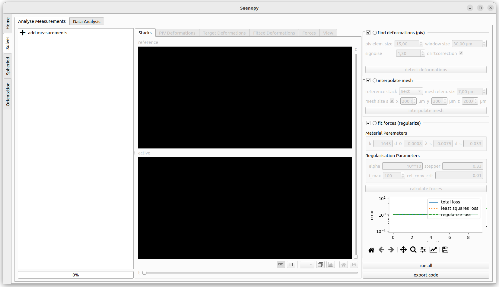

Interface
=========

The Solver part has an interface with three parts. On the left side all the current loaded files are shown.
New files can be added here. The central part shows the visualisations of the different evaluation steps. The right
panel shows the parameters the different evaluation steps.

Adding Measurements
-------------------

.. figure:: images/interface/solver_load.png

The left panel shows the loaded measurements. You can drag saenopy files here to load them directly or click on
`add measurement` to open a dialog to select measurements.

Loading a New Measurement
~~~~~~~~~~~~~~~~~~~~~~~~~

A measurement consists of one or more image stacks where cells are deforming the fibre matrix and a reference state.
The reference state can either be a single image stack showing a force-free time point (e.g. at the beginning before the
matrix has been deformed, or a drug induced relaxation) or if no force-free image stack is available the deformations
can be calculated between subsequent time steps of a recording (with the option to later subtract the median deformation).

If a reference stack is available it should be provided on the left side. On the right side either a single stack or a
time series of stacks can be specified. If there is only a single stack given then a reference stack is strictly required,
else it is optional to provide one.

When loading a stack, select one .tif file of the stack. Saenopy finds all numbers in the filename and treats them as
different properties. It uses text in front of each number as the name of this property. If a property refers to one of
different recording positions which should all be evaluated (batch evaluation) the tick box "all" can be used. Batch
placeholders will be denoted with * in the filename text field below.
You have to specify which property represents the z direction ("{z}" placeholder).
Optionally a property can be defined that represents different channels to load ("{c}" placeholder). Only the current
channel will be used for the evaluation. The other channels are just for visualisation purpose.
Optionally a property indication the time point can be specified ("{t}" placeholder) if the stack is part of a time
series.

Loading an Existing Measurement
~~~~~~~~~~~~~~~~~~~~~~~~~~~~~~~
Here an existing saenopy file can be loaded.

Loading an Example Measurement
~~~~~~~~~~~~~~~~~~~~~~~~~~~~~~
This tab provided example files that can be downloaded to showcase and test various applications of saenopy. Files will
be downloaded to a user directory and directly opened in saenopy.
