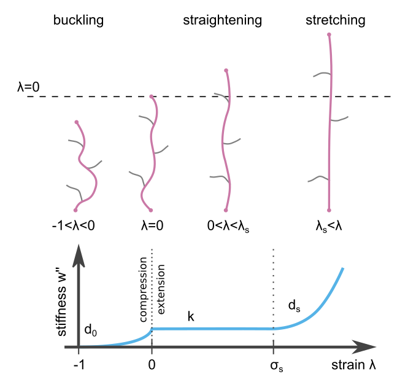

Material Parameters
===================
The material parameters :math:`k`, :math:`d_0`, :math:`\lambda_s`, and :math:`d_s` are explained in the section
:ref:`SectionMaterial`.

Linear Material:

| k                   | d_0  | λ_s  | λ_0  |
|---------------------|------|------|------|
| Young's Modulus * 6 | None | None | None |

Fibrin Material:

| k                   | d_0  | λ_s  | λ_0  | ref |
|---------------------|------|------|------|-----|
| Young's Modulus * 6 | 123  | None | None | doi |

Collagen Material:

| k                   | d_0  | λ_s  | λ_0  | ref |
|---------------------|------|------|------|-----|
| Young's Modulus * 6 | 123  | None | None | doi |
