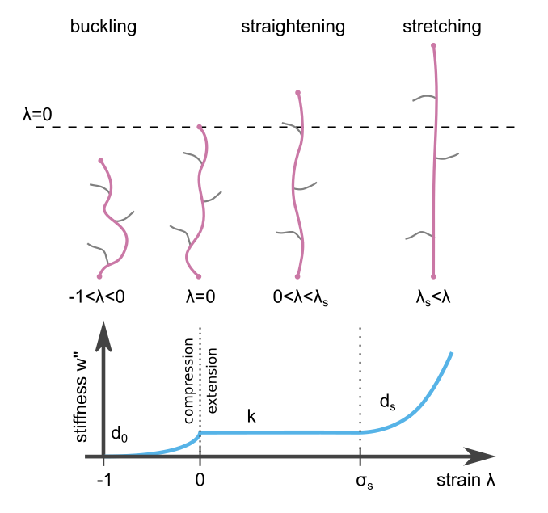

Material Parameters
===================
The material parameters :math:`k`, :math:`d_0`, :math:`\lambda_s`, and :math:`d_s` are explained in the section
:ref:`SectionMaterial`.

Meaning of the parameters
-------------------------

.. list-table::
   :header-rows: 1
   :widths: 15 85

   * - Parameter
     - Meaning
   * - :math:`k`
     - Stiffness of the material in the linear regime.
   * - :math:`d_0`
     - Decay parameter in the buckling regime. If omitted, the material shows no
       buckling but a linear response under compression.
   * - :math:`\lambda_s`
     - Stretch at which strain stiffening starts. If omitted, the material shows
       no strain stiffening.
   * - :math:`d_s`
     - How strong the strain stiffening is. If omitted, the material shows no
       strain stiffening.

Setting only :math:`k` and omitting the other three gives a linear material,
which is what :py:class:`~saenopy.materials.LinearMaterial` does.

Measured values
---------------

.. list-table::
   :header-rows: 1
   :widths: 30 14 14 14 14 14

   * - Material
     - :math:`k`
     - :math:`d_0`
     - :math:`\lambda_s`
     - :math:`d_s`
     - Source
   * - Collagen I hydrogel, 1.2 mg/ml
     - 1449
     - 0.00215
     - 0.032
     - 0.055
     - default of the spheroid lookup table
   * - Linear material
     - Young's modulus :math:`\times` 6
     - —
     - —
     - —
     - by definition

Values for other matrices have to be taken from the literature or fitted to a
rheological measurement of the specific gel; they depend strongly on
concentration and polymerisation conditions.
