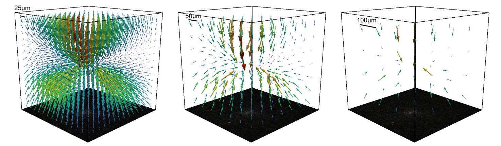

Create Finite Element Mesh
==========================
reference stack
~~~~~~~~~~~~~~~
This parameter can have values depending on the type of experiment. If the experiment has a
specified reference stack (with the relaxed cell) the appropriate option will be:

    - reference stack

If the measurement is a time series, it is also possible to set a single time point as the reference state 
(e.g. after cell seeding or relaxation) using the "reference stack" option. Further options are to calculate the 
deformations and forces beetween consecutive stacks at each time step ("next"), or to locally accumulate the 
deformations over time at each voxel and calculate the cumulated forces at each time step ("cumul."). Furthermore, if 
the matrix is in an undeformed state for most of the time (e.g. moving cells imaged over a long periods of time), 
the median state over subsequent stacks can be calculated and used as a reference stack ("median"). 
 
    - reference stack
    - next
    - median
    - cumul.
    

mesh element size
~~~~~~~~~~~~~~~~~
The element size for the mesh to which the mesh from the PIV step will be interpolated.
Smaller element sizes will produce a finer mesh, which will capture more detail of the deformation field, but will take longer to 
calculate in the Fit Forces step. To reduce the loss of information when interpolating to a new mesh, it may 
be beneficial to use the same mesh size as the final mesh or an integral multiple of it.

mesh size same
~~~~~~~~~~~~~~
Whether to use the same mesh size as the piv mesh. If unchecked, a custom mesh size can be specified. Smaller mesh sizes
then the PIV mesh would cut off information. Larger mesh sizes can be good if the piv mesh is very small and the spatial
decay of the deformation field is not well captured. Larger mesh sizes can lead to more accurate force reconstructions.

.. figure:: images/parameters/mesh_total_size.png
