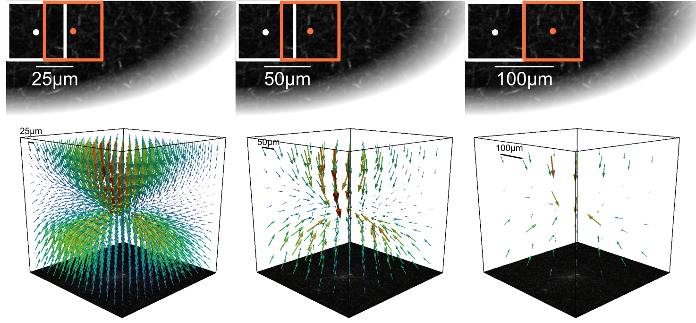
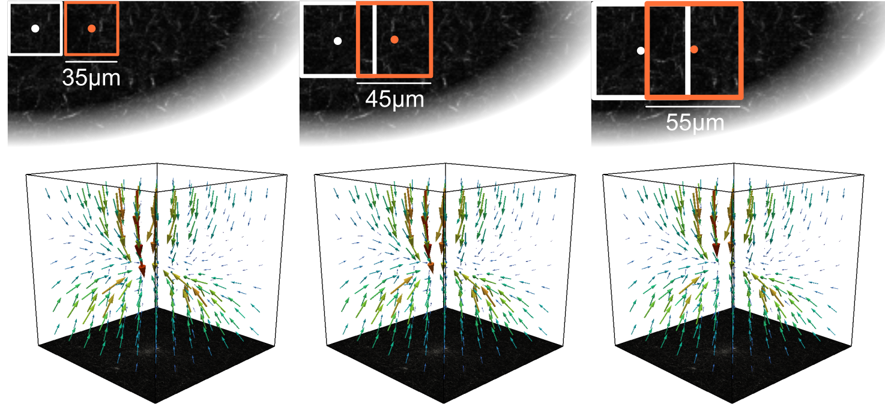

Detect Deformations
===================

piv element size
----------------
The size of the mesh used by the Particle Image Velocimetry (PIV) algorithm.
The algorithm searches for deformations at points
`piv_element_size` μm apart.

Smaller element sizes result in longer run times for the piv step.
To reduce information loss
when interpolating to a new mesh, it may be advantageous to use the same mesh size as the final mesh or an integer multiple of it.

window size
-----------
The size of the search window for the piv algorithm.
A rectangle with a width of `search_window` μm around each node in the target image is searched
in the reference image. The resulting offset is the measured deformation.

Larger search windows result in longer run times for the piv step.
An appropriate window size should be chosen that is large enough to capture the
magnitude of the deformations (~4 larger than the largest deformation magnitude) 
but not overly large to smear the deformation field and reduce the spatial resolution. 
For an increased spatial resolution it is often helpful to have a reasonable
overlap between adjacent windows (e.g. 50% by using windowsize = 2 * elementsize).

signal to noise
---------------
The signal to noise ratio threshold. Points with higher noise are set to "nan" (not a number). Nan values are nodes where
no deformation has been found and are therefore not constrained when fitting deformations. 
Default is 1.3, that replaces deformations with a signal-to-noise ratio < 1.3 with "nan".

drift correction
----------------
Whether to apply a drift correction by subtracting the median deformation from the found deformations. This is useful if
the target stack has a global shift with respect to the reference stack.
