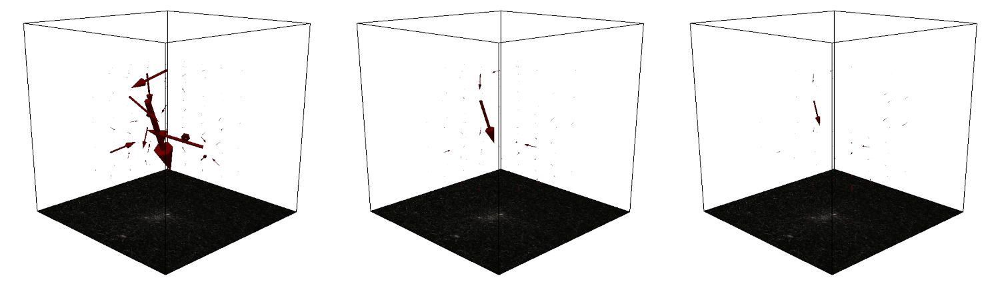

Regularisation Parameters
=========================
alpha
-----
How much to regularise the forces.
This is the most important parameter of the regularisation step.

A **low alpha** value results in a good fit of the measured
deformations but can lead to more higher forces and thus increases the chance to obtain spurious forces that only explain
the measurement noise from measuring the displacement field.

A **high alpha** value makes the regularisation procedure focus more on obtaining small
forces then to match the measured deformation field well. This can lead to a weak force field.

step size
---------
The step size of one regularisation step. In case everything would be completely linear without material or geometrical
non-linearities, a stepper of 1 would result in a perfect fit within one iteration. Small stepper values increase the
number of iterations needed to find a solution.

max iterations
--------------
The maximum number of iterations after which to stop the fitting procedure if the rel. conv. crit. did not terminate the
iteration earlier.

rel. conv. crit.
----------------
The relative convergence criterion. If the standard deviation of the energy of the last 6 iterations divided my the mean
does not exceed this value, the fitting procedure is considered converged and iterations are stopped.

prev_t_as_start
---------------
Optional for time lapse series: If enabled, the deformation field of the previous time step is used as the starting point 
for the force reconstruction of the following time step. This can be useful for force reconstruction of spheroids and organoids
that gradually increase their force over time. Here the option can speed up the convergence process by a factor of 5-50.

Surface regularisation
----------------------
Standard bulk regularisation does not require a cell stain. The optional surface
mode uses a segmented cell stain to penalise surface traction and suppress bulk
forces. Both modes retain the existing exclusion of outer boundary forces.

Select the cell channel and check **preview segmentation**. The selected threshold
method (Li by default; Otsu and Yen are alternatives) is applied to a Gaussian-smoothed
image, then multiplied by the threshold factor (default 0.6). The method is not
selected automatically. Surface dilation adds mesh-node shells. A segmentation
touching the image boundary is treated as an observed open interface, without
inventing end caps. Calculating forces recomputes segmentation from the current
settings even if no preview was requested.

New GUI fits use mesh-normalised alpha, referenced to a 14 micrometre mesh.
Classic uses volume-density Huber weights; Surface uses area-weighted L2 traction
and a finite bulk penalty. With active nodal volumes :math:`V_i`, measured cell
area :math:`A`, and node counts :math:`N_s, N_b`, the conversion is

.. math::

   \alpha_h = \alpha (h_\mathrm{ref}/h)^5, \qquad
   d = \frac{\sum_i V_i}{A}\frac{N_s}{N_b+N_s}, \qquad
   \alpha_s = \alpha_h d.

The Surface bulk weight is :math:`1/d`, so its bulk coefficient remains
:math:`\alpha_h`. Lengths are in metres; no force-fitted calibration constant is
used. Equal optimal alpha or equal contractility between modes is not guaranteed.
Old files retain their recorded results and legacy settings on load.

For an existing result with an interpolated mesh, the shared Python entry point is::

    from saenopy.reconstruction import fit_result

    fit_result(result, index=0, parameters=dict(
        surface=True, physical_normalization=True, alpha=1e10,
        seg_channel=1, seg_threshold_method="li", seg_threshold_factor=0.6,
        seg_dilate_layers=1, max_iterations=200, cg_maxiter_factor=4))
    result.save("surface.saenopy")

Use ``surface=False`` for Classic; ``physical_normalization=False`` additionally
selects the unnormalised Classic control in Python. The GUI's **save Python code**
exports the current settings and calls the same reconstruction function.

The inner conjugate-gradient iteration budget defaults to four times the previous
cap (``cg_maxiter_factor=4``), but still stops earlier when converged. This does not
increase the nonlinear outer step size. Unconverged inner solves are reported;
more outer iterations alone do not establish convergence.

