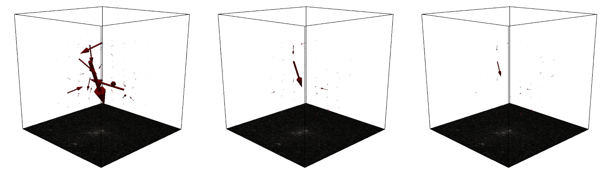

Regularisation Parameters
=========================
alpha
-----
How much to regularise the forces.
This is the most important parameter of the regularisation step.

A **low alpha** value results in a good fit of the measured
deformations but can lead to more higher forces and thus increases the chance to obtain spurious forces that only explain
the measurement noise from measuring the displacement field.

A **high alpha** value makes the regularisation procedure focus more on obtaining small
forces then to match the measured deformation field well. This can lead to a weak force field.

step size
---------
The step size of one regularisation step. In case everything would be completely linear without material or geometrical
non-linearities, a stepper of 1 would result in a perfect fit within one iteration. Small stepper values increase the
number of iterations needed to find a solution.

max iterations
--------------
The maximum number of iterations after which to stop the fitting procedure if the rel. conv. crit. did not terminate the
iteration earlier.

rel. conv. crit.
----------------
The relative convergence criterion. If the standard deviation of the energy of the last 6 iterations divided my the mean
does not exceed this value, the fitting procedure is considered converged and iterations are stopped.

prev_t_as_start
---------------
Optional for time lapse series: If enabled, the deformation field of the previous time step is used as the starting point 
for the force reconstruction of the following time step. This can be useful for force reconstruction of spheroids and organoids
that gradually increase their force over time. Here the option can speed up the convergence process by a factor of 5-50.

