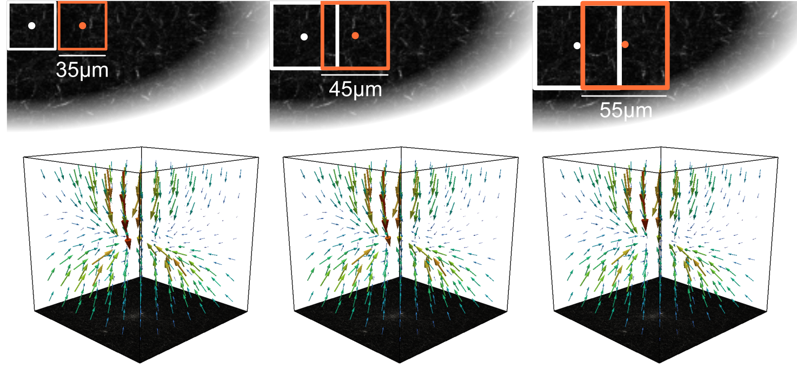
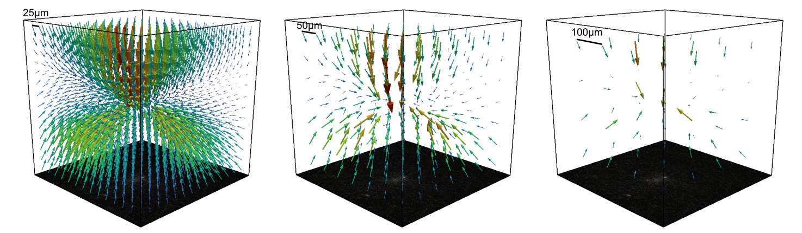
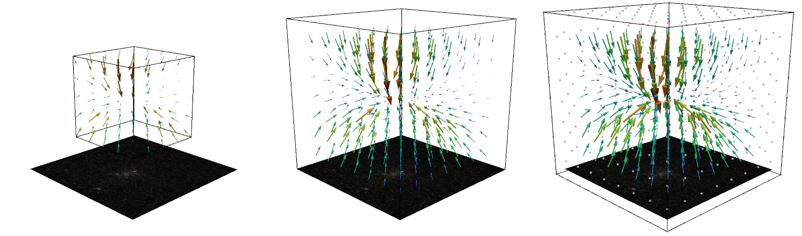
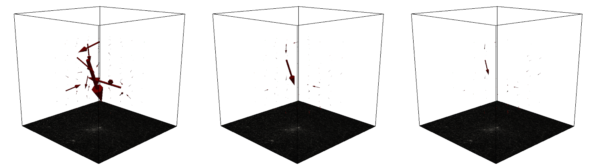

Interface Solver
================

.. figure:: images/Interface_solver_main.png

The Solver part has an interface with three parts. On the left side all the current loaded files are shown.
New files can be added here. The central part shows the visualisations of the different evaluation steps. The right
panel shows the parameters the different evaluation steps.

Adding Measurements
-------------------

.. figure:: images/Interface_solver_load.png

The left panel shows the loaded measurements. You can drag saenopy files here to load them directly or click on
`add measurement` to open a dialog to select measurements.

Loading a New Measurement
~~~~~~~~~~~~~~~~~~~~~~~~~

A measurement consists of one or more image stacks where cells are deforming the fibre matrix and a reference state.
The reference state can either be a single image stack showing a force-free time point (e.g. at the beginning before the
matrix has been deformed, or a drug induced relaxation) or if no force-free image stack is available the deformations
can be calculated between subsequent time steps of a recording (with the option to later subtract the median deformation).

If a reference stack is available it should be provided on the left side. On the right side either a single stack or a
time series of stacks can be specified. If there is only a single stack given then a reference stack is strictly required,
else it is optional to provide one.

When loading a stack, select one .tif file of the stack. Saenopy finds all numbers in the filename and treats them as
different properties. It uses text in front of each number as the name of this property. If a property refers to one of
different recording positions which should all be evaluated (batch evaluation) the tick box "all" can be used. Batch
placeholders will be denoted with * in the filename text field below.
You have to specify which property represents the z direction ("{z}" placeholder).
Optionally a property can be defined that represents different channels to load ("{c}" placeholder). Only the current
channel will be used for the evaluation. The other channels are just for visualisation purpose.
Optionally a property indication the time point can be specified ("{t}" placeholder) if the stack is part of a time
series.

Loading an Existing Measurement
~~~~~~~~~~~~~~~~~~~~~~~~~~~~~~~
Here an existing saenopy file can be loaded.

Loading an Example Measurement
~~~~~~~~~~~~~~~~~~~~~~~~~~~~~~
This tab provided example files that can be downloaded to showcase and test various applications of saenopy. Files will
be downloaded to a user directory and directly opened in saenopy.

Detect Deformations
-------------------

piv element size
~~~~~~~~~~~~~~~~
The size of the mesh used by the Particle Image Velocimetry (PIV) algorithm.
The algorithm searches for deformations at points
`piv_element_size` μm apart.

Smaller element sizes result in longer run times for the piv step.
To reduce information loss
when interpolating to a new mesh, it may be advantageous to use the same mesh size as the final mesh or an integer multiple of it.

.. figure:: images/parameters/piv_mesh_size.png

window size
~~~~~~~~~~~
The size of the search window for the piv algorithm.
A rectangle with a width of `search_window` μm around each node in the target image is searched
in the reference image. The resulting offset is the measured deformation.

Larger search windows result in longer run times for the piv step.
An appropriate window size should be chosen that is large enough to capture the
magnitude of the deformations (~4 larger than the largest deformation magnitude) 
but not overly large to smear the deformation field and reduce the spatial resolution. 
For an increased spatial resolution it is often helpful to have a reasonable
overlap between adjacent windows (e.g. 50% by using windowsize = 2 * elementsize).

signoise
~~~~~~~~
The signal to noise ratio threshold. Points with higher noise are set to "nan" (not a number). Nan values are nodes where
no deformation has been found and are therefore not constrained when fitting deformations. 
Default is 1.3, that replaces deformations with a signal-to-noise ratio < 1.3 with "nan".

driftcorrection
~~~~~~~~~~~~~~~
Whether to apply a drift correction by subtracting the median deformation from the found deformations. This is useful if
the target stack has a global shift with respect to the reference stack.

Create Finite Element Mesh
--------------------------
reference stack
~~~~~~~~~~~~~~~
This parameter can have values depending on the type of experiment. If the experiment has a
specified reference stack (with the relaxed cell) the appropriate option will be:

    - reference stack

If the measurement is a time series, it is also possible to set a single time point as the reference state 
(e.g. after cell seeding or relaxation) using the "reference stack" option. Further options are to calculate the 
deformations and forces beetween consecutive stacks at each time step ("next"), or to locally accumulate the 
deformations over time at each voxel and calculate the cumulated forces at each time step ("cumul."). Furthermore, if 
the matrix is in an undeformed state for most of the time (e.g. moving cells imaged over a long periods of time), 
the median state over subsequent stacks can be calculated and used as a reference stack ("median"). 
 
	- reference stack
	- next
	- median
	- cumul.
    

mesh element size
~~~~~~~~~~~~~~~~~
The element size for the mesh to which the mesh from the PIV step will be interpolated.
Smaller element sizes will produce a finer mesh, which will capture more detail of the deformation field, but will take longer to 
calculate in the Fit Forces step. To reduce the loss of information when interpolating to a new mesh, it may 
be beneficial to use the same mesh size as the final mesh or an integral multiple of it.

mesh size same
~~~~~~~~~~~~~~
Whether to use the same mesh size as the piv mesh. If unchecked, a custom mesh size can be specified. Smaller mesh sizes
then the PIV mesh would cut off information. Larger mesh sizes can be good if the piv mesh is very small and the spatial decay of the
and the spatial decay of the deformation field is not well captured. Larger mesh sizes can lead to more accurate force
reconstructions.

Fit Deformations and Calculate Forces
-------------------------------------

Material Parameters
~~~~~~~~~~~~~~~~~~~
The material parameters :math:`k`, :math:`d_0`, :math:`\lambda_s`, and :math:`d_s` are explained in the section
:ref:`SectionMaterial`.

.. figure:: images/fiber.png
    :width: 70%

Regularisation Parameters
~~~~~~~~~~~~~~~~~~~~~~~~~
alpha
~~~~~
How much to regularise the forces.
This is the most important parameter of the regularisation step.

A **low alpha** value results in a good fit of the measured
deformations but can lead to more higher forces and thus increases the chance to obtain spurious forces that only explain
the measurement noise from measuring the displacement field.

A **high alpha** value makes the regularisation procedure focus more on obtaining small
forces then to match the measured deformation field well. This can lead to a weak force field.

stepper
~~~~~~~
The step width of one regularisation step. In case everything would be completely linear without material or geometrical
non-linearities, a stepper of 1 would result in a perfect fit within one iteration. Small stepper values increase the
number of iterations needed to find a solution.

i_max
~~~~~
The maximum number of iterations after which to stop the fitting procedure if the rel_conv_crit did not terminate the
iteration earlier.

rel_conv_crit
~~~~~~~~~~~~~
The relative convergence criterion. If the standard deviation of the energy of the last 6 iterations divided my the mean
does not exceed this value, the fitting procedure is considered converged and iterations are stopped.

prev_t_as_start
~~~~~~~~~~~~~~~
Optional for time lapse series: If enabled, the deformation field of the previous time step is used as the starting point 
for the force reconstruction of the following time step. This can be useful for force reconstruction of spheroids and organoids
that gradually increase their force over time. Here the option can speed up the convergence process by a factor of 5-50.

